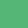
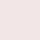
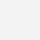

# Colors

Sirv's main color is called the Sirv blue.

| Color Name                | Swatch                   | Hex Code |
| ------------------------- | ------------------------ | -------- |
| Sirv blue                 |  | #327bba  |
| Documentation red         |  | #c42734  |
| Plugin enabled            |  | #55B676  |
| Plugin disabled           |  | #F04E28  |
| Web app grape             |  | #4B475B  |
| Web app grape hover       |  | #57526A  |
| Web app button            |  | #2586DA  |
| Web app button hover      |  | #1F72B9  |
| Web app notification red  |  | #E53935  |
| Web app notification pink |  | #F3E6E6  |
| Web app light grey        |  | #F1F1F2  |

